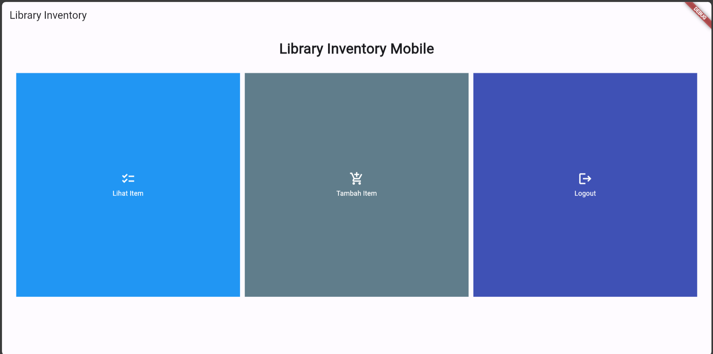

# Library Inventory Mobile

<details>

<summary>Tugas 7</summary>

<h1>Perbedaan Utama antara Stateless dan Stateful Widget dalam Konteks Pengembangan Aplikasi Flutter</h1>

<h2>Stateless Widget</h2>

`Stateless` widgets merupakan widget yang bersifat statis atau tidak dapat berubah setelah dibuat. Widget ini digunakan untuk tampilan yang tidak memerlukan perubahan atau interaksi yang kompleks. `Stateless` widgets hanya memiliki `build` method dan tidak menyimpan data yang dapat berubah. 

<h2>Stateful Widget</h2>

`Stateful` widgets merupakan widget yang dapat berubah atau memiliki keadaan (state) yang dapat diperbarui. Widget ini digunakan untuk tampilan yang memerlukan interaksi pengguna, input, atau perubahan berdasarkan data yang dapat berubah. `Stateful` widgets memiliki dua kelas terpisah, yaitu kelas widget yang bersifat statis dan kelas `State` yang dapat berubah.

<h1>Widget yang Digunakan pada Tugas 7</h1>

1. `MyApp` (Stateless Widget) : Widget utama yang mendefinisikan aplikasi Flutter dan mendefinisikan tema serta merujuk ke halaman utama.

2. `MyHomePage` (Stateless Widget) : Widget yang menampilkan halaman utama aplikasi dan membuat daftar item dengan menggunakan `GridView` yang memuat widget `BookCard`.

3. `BookItem` (Class) : Widget yang mewakili objek yang berisi data item buku, seperti nama, ikon, dan warna. Widget ini digunakan untuk membuat daftar item buku dalam `MyHomePage`.

4. `BookCard` (Stateless Widget) : Widget yang menampilkan setiap item buku dalam bentuk kartu (card). Widget ini menggunakan `Material` untuk memberikan latar belakang dengan warna dari `BookItem`. Widget ini menggunakan `InkWell` untuk membuat area yang responsif terhadap sentuhan (tappable), sehingga ketika diklik akan menampilkan `SnackBar` yang memberi informasi tentang item yang diklik. Widget ini juga dapat menampilkan ikon dan teks yang sesuai dengan item buku dari `BookItem`.

5. `SingleChildScrollView` : Widget yang menyediakan kemampuan untuk melakukan scroll pada konten yang melebihi ukuran layar. Widget ini dapat membungkus `Padding` yang berisi `Column`.

6. `Padding` : Widget yang memberikan jarak antara widget dengan widget lainnya. Widget ini digunakan untuk memberikan jarak antara tepi layar dengan konten, serta antara judul dengan grid layout.

7. `Column` : Widget yang menampilkan widget-widget lainnya secara vertikal. Widget ini digunakan untuk menampilkan judul dan grid layout.

8. `Text` : Widget yang menampilkan teks dengan berbagai atribut, seperti alignment, style, dan font. Widget ini digunakan untuk menampilkan judul aplikasi.

9. `GridView.count` : Widget yang menampilkan widget-widget lainnya dalam bentuk grid dengan jumlah kolom yang ditentukan. Widget ini digunakan untuk menampilkan tiga tombol sederhana dengan ikon dan teks.

10. `Icon` : Widget yang menampilkan ikon dengan berbagai atribut, seperti warna, ukuran, dan jenis. Widget ini digunakan untuk menampilkan ikon pada setiap item pada grid layout.

<h1>Implementasi Checklist</h1>

Untuk langkah pertama, saya membuat direktori `library_mobile` sebagai direktori proyek Flutter yang akan dibuat. Setelah itu, saya membuat aplikasi Flutter dengan nama `library_mobile` dengan perintah berikut.
```bash
flutter create library_mobile
```
Kemudian saya membuat file baru `menu.dart` dalam `library_mobile/lib` dan memberikan import berikut pada awal file.
```dart
import 'package:flutter/material.dart';
```
Kemudian saya memindahkan class `MyHomePage` dan `_MyHomePageState` dari file `main.dart` ke dalam file `menu.dart` dan menambahkan warna tertentu untuk masing-masing tombol dari widget `BookItem` agar memiliki warna yang berbeda-beda sebagai penerapan dari `BONUS` pada tugas 7 ini, sehingga isi dari file `menu.dart` adalah sebagai berikut.
```dart
import 'package:flutter/material.dart';

class MyHomePage extends StatelessWidget {
    MyHomePage({Key? key}) : super(key: key);

    final List<BookItem> items = [
        BookItem("Lihat Item", Icons.checklist, Colors.blue),
        BookItem("Tambah Item", Icons.add_shopping_cart, Colors.blueGrey),
        BookItem("Logout", Icons.logout, Colors.indigo),
    ];

    @override
    Widget build(BuildContext context) {
        return Scaffold(
          appBar: AppBar(
            title: const Text(
              'Library Inventory',
            ),
          ),
          body: SingleChildScrollView(
            // Widget wrapper yang dapat discroll
            child: Padding(
              padding: const EdgeInsets.all(10.0), // Set padding dari halaman
              child: Column(
                // Widget untuk menampilkan children secara vertikal
                children: <Widget>[
                  const Padding(
                    padding: EdgeInsets.only(top: 10.0, bottom: 10.0),
                    // Widget Text untuk menampilkan tulisan dengan alignment center dan style yang sesuai
                    child: Text(
                      'Library Inventory Mobile', // Text yang menandakan toko
                      textAlign: TextAlign.center,
                      style: TextStyle(
                        fontSize: 30,
                        fontWeight: FontWeight.bold,
                      ),
                    ),
                  ),
                  // Grid layout
                  GridView.count(
                    // Container pada card kita.
                    primary: true,
                    padding: const EdgeInsets.all(20),
                    crossAxisSpacing: 10,
                    mainAxisSpacing: 10,
                    crossAxisCount: 3,
                    shrinkWrap: true,
                    children: items.map((BookItem item) {
                      // Iterasi untuk setiap item
                      return BookCard(item);
                    }).toList(),
                  ),
                ],
              ),
            ),
          ),
        );
    }
}

class BookItem {
  final String name;
  final IconData icon;
  final Color color;
  BookItem(this.name, this.icon, this.color);
}

class BookCard extends StatelessWidget {
  final BookItem item;

  const BookCard(this.item, {super.key}); // Constructor

  @override
  Widget build(BuildContext context) {
    return Material(
      color: item.color,
      child: InkWell(
        // Area responsive terhadap sentuhan
        onTap: () {
          // Memunculkan SnackBar ketika diklik
          ScaffoldMessenger.of(context)
            ..hideCurrentSnackBar()
            ..showSnackBar(SnackBar(
                content: Text("Kamu telah menekan tombol ${item.name}!")));
        },
        child: Container(
          // Container untuk menyimpan Icon dan Text
          padding: const EdgeInsets.all(8),
          child: Center(
            child: Column(
              mainAxisAlignment: MainAxisAlignment.center,
              children: [
                Icon(
                  item.icon,
                  color: Colors.white,
                  size: 30.0,
                ),
                const Padding(padding: EdgeInsets.all(3)),
                Text(
                  item.name,
                  textAlign: TextAlign.center,
                  style: const TextStyle(color: Colors.white),
                ),
              ],
            ),
          ),
        ),
      ),
    );
  }
}
```
Agar program tetap dapat mengakses isi dari file `menu.dart`, maka pada file `main.dart` ditambahkan import sebagai berikut.
```dart
import 'package:library_mobile/menu.dart';
```

Tampilan akhir dari tugas 7 adalah sebagai berikut.


<h2>Melakukan Add, Commit, dan Push ke GitHub</h2>

Kita dapat melakukan `add` dari semua file yang diperbarui dengan perintah 
```bash
git add .
``` 
kemudian melakukan `commit` "Tugas 7" dengan perintah 
```bash
git commit -m "Tugas 7"
``` 
dan yang terakhir melakukan `push` ke repository GitHub dengan perintah
```bash
git push -u origin main
```

</details>

<details>

<summary>Tugas 8</summary>

<h1>Navigator.push() dan Navigator.pushReplacement()</h1>

Method `Navigator.push()` menambahkan suatu *route* ke dalam *stack route* yang dikelola oleh `Navigator`. Method ini menyebabkan *route* yang ditambahkan berada pada paling atas stack, sehingga *route* yang baru saja ditambahkan tersebut akan muncul dan ditampilkan kepada pengguna. Contoh penggunaannya adalah ketika pengguna menekan tombol kembali, maka aplikasi akan kembali ke halaman sebelumnya.

Method `Navigator.pushReplacement()` menghapus *route* yang sedang ditampilkan kepada pengguna dan menggantinya dengan suatu *route*. Method ini menyebabkan aplikasi untuk berpindah dari *route* yang sedang ditampilkan kepada pengguna ke suatu *route* yang diberikan. Pada *stack route* yang dikelola `Navigator`, *route* lama pada atas *stack akan digantikan secara langsung oleh *route* baru yang diberikan tanpa mengubah kondisi elemen *stack yang berada di bawahnya. Contoh penggunaanya adalah ketika pengguna menekan tombol kembali, maka aplikasi tidak akan kembali ke halaman sebelumnya, tetapi ke halaman sebelum halaman tersebut.

Kedua method ini memiliki perbedaan yang terletak pada apa yang dilakukan kepada *route* yang berada pada atas *stack*. `push()` akan menambahkan *route* baru di atas *route* yang sudah ada pada atas *stack*, sedangkan `pushReplacement()` menggantikan *route* yang sudah ada pada atas *stack* dengan *route* baru tersebut. Penting juga untuk memperhatikan kemungkinan urutan dan isi dari *stack*, karena jika kondisi *stack* kosong serta kita menekan tombol **Back** pada gawai, maka sistem akan keluar dari aplikasi. 

<h1>Flutter Widget Layout</h1>

Flutter menyediakan berbagai macam widget layout yang dapat mengatur tata letak dari *interface* pengguna sebagai berikut.

1. `Container`    : Merupakan widget yang menggabungkan penempatan dan juga menampung elemen atau widget lainnya.
2. `Align`        : Mengatur widget dari child ke posisi yang diinginkan di dalam *parent widget*.
3. `Row`          : Mengatur susunan dari widget atau komponen-komponen UI secara horizontal (row).
4. `Column`       : Mengatur susunan dari widget atau komponen-komponen UI secara vertikal (column).
5. `GridView`     : Widget yang mengimplementasikan komponen dari daftar grid.
6. `ListView`     : Menampilkan *child* satu per satu dalam arah *scroll*.
7. `Stack`        : Widget yang berguna untuk menumpuk beberapa *child* dengan sederhana.
8. `Padding`      : Widget yang dapat memberikan padding pada *child*.
9. `Expanded`     : Widget yang memperluas *child* dari Row, Column, ataupun Flex.
10. `Transform`   : Menerapkan transformasi sebelum memberikan warna pada *child*.

<h1>Elemen Input Form</h1>

1. `Form`          : Wadah yang digunakan untuk melakukan pengelompokan beberapa *widget* bidang formulir, seperti *TextField widgets*.
2. `FormField`     : Mempertahankan status kolom dari formulir, sehingga semua pembaruan dan kesalahan validasi akan tercermin secara visual pada *inteface*.
3. `TextFormField` : Membuat area input teks pada form yang dapat disesuaikan dengan berbagai properti dan validasi.

<h1>Penerapan Clean Architecture pada Flutter</h1>

Berikut adalah beberapa penerapan dari *Clean Architecture* pada Flutter.
1. *Presentation Layer* (UI)

Berisikan komponen-komponen antarmuka pengguna untuk menangani interaksi pengguna dan merender *user interface*. Hal tersebut harus terbebas dari detail implementasi logika bisnis dan akses data.

2. *Domain Layer* (*Business Logic*)

Mewakili inti dari logika bisnis dengan kasus penggunaan, entitas, dan aturan bisnis. Bersifat agnostik terhadap kerangka atau teknologi tertentu.

3. *Data Layer*

Bertanggung jawab atas pengambilan dan penyimpanan data melalui repositori dan sumber data. Melindungi lapisan domain dari detail penyimpanan dan pengambilan data.

<h1>Implementasi Checklist</h1>

<h2> Menambahkan Drawer Menu </h2>

Membuat berkas baru yang bernama `left_drawer.dart` dalam direktori *widgets* dan menambahkan kode berikut untuk membuat drawer menu dengan navigasi ke halaman-halaman tertentu, seperti `MyHomePage` dan `ShopFormPage`
```dart
//OK TODO Implement this library.
import 'package:flutter/material.dart';
import 'package:library_mobile/screens/menu.dart';

// OK TODO: Impor halaman ShopFormPage jika sudah dibuat
import 'package:library_mobile/screens/shoplist_form.dart';

class LeftDrawer extends StatelessWidget {
  const LeftDrawer({super.key});

  @override
  Widget build(BuildContext context) {
    return Drawer(
      child: ListView(
        children: [
          const DrawerHeader(
            // OK TODO: Bagian drawer header
            decoration: BoxDecoration(
              color: Colors.indigo,
            ),
            child: Column(
              children: [
                Text(
                  'Book List',
                  textAlign: TextAlign.center,
                  style: TextStyle(
                    fontSize: 30,
                    fontWeight: FontWeight.bold,
                    color: Colors.white,
                  ),
                ),
                Padding(padding: EdgeInsets.all(10)),
                Text("Catat seluruh keperluan belanjamu di sini!",
                    // OK TODO: Tambahkan gaya teks dengan center alignment, font ukuran 15, warna putih, dan weight biasa
                    textAlign: TextAlign.center,
                    style: TextStyle(
                      fontSize: 15,
                      color: Colors.white,
                      fontWeight: FontWeight.normal,
                    ),
                ),
              ],
            ),
          ),
          ListTile(
            leading: const Icon(Icons.home_outlined),
            title: const Text('Halaman Utama'),
            // Bagian redirection ke MyHomePage
            onTap: () {
              Navigator.pushReplacement(
                  context,
                  MaterialPageRoute(
                    builder: (context) => MyHomePage(),
                  ));
            },
          ),
          ListTile(
            leading: const Icon(Icons.add_shopping_cart),
            title: const Text('Tambah Produk'),
            // Bagian redirection ke ShopFormPage
            onTap: () {
              /*
              OK TODO: Buatlah routing ke ShopFormPage di sini,
              setelah halaman ShopFormPage sudah dibuat.
              */
              Navigator.pushReplacement(
                context,
                MaterialPageRoute(
                  builder: (context) => ShopFormPage(),
                )
              );
            },
          ),
        ],
      ),
    );
  }
}
```

<h2> Menambahkan Form dan Elemen Input </h2>

Membuat berkas baru bernama `shoplist_form.dart` dan menambahkan variabel `_formKey` sebagai `GlobalKey` untuk mengelola state form. Kemudian pada tahapan ini kita akan mengimplementasikan `TextFormField` untuk menerima input nama produk, jumlah, dan deskripsi. Dalam implementasi ini kita menggunakan `Padding` dan `Column` untuk mengatur tata letak elemen input dan validasi input serta menampilkan pesan kesalahan jika tidak valid.
```dart
import 'package:flutter/material.dart';
// OK TODO: Impor drawer yang sudah dibuat sebelumnya
import 'package:library_mobile/widgets/left_drawer.dart';

class ShopFormPage extends StatefulWidget {
  const ShopFormPage({super.key});

  @override
  State<ShopFormPage> createState() => _ShopFormPageState();
}

class _ShopFormPageState extends State<ShopFormPage> {
  final _formKey = GlobalKey<FormState>();
  String _name = "";
  int _amount = 0;
  String _description = "";

  @override
  Widget build(BuildContext context) {
    return Scaffold(
      appBar: AppBar(
        title: const Center(
          child: Text(
            'Form Tambah Produk',
          ),
        ),
        backgroundColor: Colors.indigo,
        foregroundColor: Colors.white,
      ),
      // OK TODO: Tambahkan drawer yang sudah dibuat di sini
      drawer: const LeftDrawer(),
      body: Form(
        key: _formKey,
        child: SingleChildScrollView(
          child: Column(
            crossAxisAlignment: CrossAxisAlignment.start,
            children: [
              Padding(
                padding: const EdgeInsets.all(8.0),
                child: TextFormField(
                  decoration: InputDecoration(
                    hintText: "Nama Produk",
                    labelText: "Nama Produk",
                    border: OutlineInputBorder(
                      borderRadius: BorderRadius.circular(5.0),
                    ),
                  ),
                  onChanged: (String? value) {
                    setState(() {
                      _name = value!;
                    });
                  },
                  validator: (String? value) {
                    if (value == null || value.isEmpty) {
                      return "Nama tidak boleh kosong!";
                    }
                    return null;
                  },
                ),
              ),
              Padding(
                padding: const EdgeInsets.all(8.0),
                child: TextFormField(
                  decoration: InputDecoration(
                    hintText: "Amount",
                    labelText: "Amount",
                    border: OutlineInputBorder(
                      borderRadius: BorderRadius.circular(5.0),
                    ),
                  ),
                  // OK TODO: Tambahkan variabel yang sesuai
                  onChanged: (String? value) {
                    setState(() {
                      _amount = int.parse(value!);
                    });
                  },
                  validator: (String? value) {
                    if (value == null || value.isEmpty) {
                      return "Amount tidak boleh kosong!";
                    }
                    if (int.tryParse(value) == null) {
                      return "Amount harus berupa angka!";
                    }
                    return null;
                  },
                ),
              ),
              Padding(
                padding: const EdgeInsets.all(8.0),
                child: TextFormField(
                  decoration: InputDecoration(
                    hintText: "Deskripsi",
                    labelText: "Deskripsi",
                    border: OutlineInputBorder(
                      borderRadius: BorderRadius.circular(5.0),
                    ),
                  ),
                  onChanged: (String? value) {
                    setState(() {
                      // OK TODO: Tambahkan variabel yang sesuai
                      _description = value!;
                    });
                  },
                  validator: (String? value) {
                    if (value == null || value.isEmpty) {
                      return "Deskripsi tidak boleh kosong!";
                    }
                    return null;
                  },
                ),
              ),
              Align(
                alignment: Alignment.bottomCenter,
                child: Padding(
                  padding: const EdgeInsets.all(8.0),
                  child: ElevatedButton(
                    style: ButtonStyle(
                      backgroundColor:
                          MaterialStateProperty.all(Colors.indigo),
                    ),
                    onPressed: () {
                      if (_formKey.currentState!.validate()) {
                        showDialog(
                          context: context,
                          builder: (context) {
                            return AlertDialog(
                              title: const Text('Produk berhasil tersimpan'),
                              content: SingleChildScrollView(
                                child: Column(
                                  crossAxisAlignment:
                                      CrossAxisAlignment.start,
                                  children: [
                                    Text('Nama: $_name'),
                                    // OK TODO: Munculkan value-value lainnya
                                    Text('Amount: $_amount'),
                                    Text('Deskripsi: $_description'),
                                  ],
                                ),
                              ),
                              actions: [
                                TextButton(
                                  child: const Text('OK'),
                                  onPressed: () {
                                    Navigator.pop(context);
                                  },
                                ),
                              ],
                            );
                          },
                        );
                        _formKey.currentState!.reset();
                      }

                    },
                    child: const Text(
                      "Save",
                      style: TextStyle(color: Colors.white),
                    ),
                  ),
                ),
              ),
            ]
          ),  
        ),
      ),
    );
  }
}
```

<h2> Menampikan Data </h2>

Dalam tahapan ini kita menggunakan `showDialog()` untuk menampilkan `AlertDialog` ketika tombol `Save` ditekan oleh pengguna. Dalam `AlertDialog` akan ditampilkan data yang dimasukkan pada form, dan melakukan reset form setelah data telah tersimpan.
```dart
...
if (_formKey.currentState!.validate()) {
  showDialog(
    context: context,
    builder: (context) {
      return AlertDialog(
        title: const Text('Produk berhasil tersimpan'),
        content: SingleChildScrollView(
          child: Column(
            crossAxisAlignment:
                CrossAxisAlignment.start,
            children: [
              Text('Nama: $_name'),
              // OK TODO: Munculkan value-value lainnya
              Text('Amount: $_amount'),
              Text('Deskripsi: $_description'),
            ],
          ),
        ),
        actions: [
          TextButton(
            child: const Text('OK'),
            onPressed: () {
              Navigator.pop(context);
            },
          ),
        ],
      );
    },
  );
  _formKey.currentState!.reset();
}
...
```

<h2> Menambahkan Fitur Navigasi pada Tombol </h2>

Pada widget `BookItem` di dalam berkas `shop_card.dart` saya menambahkan `Navigator.push()` pada atribut `onTap` yang menudian akan disesuaikan dengan navigasi berdasarkan jenis tombol yang ditekan, misalnya navigasi ke halaman `ShopFormPage` seperti berikut.
```dart
class BookCard extends StatelessWidget {
  final BookItem item;

  const BookCard(this.item, {super.key}); // Constructor

  @override
  Widget build(BuildContext context) {
    return Material(
      color: item.color,
      child: InkWell(
        // Area responsive terhadap sentuhan
        onTap: () {
          // Memunculkan SnackBar ketika diklik
          ScaffoldMessenger.of(context)
            ..hideCurrentSnackBar()
            ..showSnackBar(SnackBar(
                content: Text("Kamu telah menekan tombol ${item.name}!")));

          // Navigate ke route yang sesuai (tergantung jenis tombol)
          if (item.name == "Tambah Item") {
            // OK TODO: Gunakan Navigator.push untuk melakukan navigasi ke MaterialPageRoute yang mencakup ShopFormPage.
            Navigator.push(
              context,
              MaterialPageRoute(builder: (context) => ShopFormPage()),
            );
          }
        },
        child: Container(
          // Container untuk menyimpan Icon dan Text
          padding: const EdgeInsets.all(8),
          child: Center(
            child: Column(
              mainAxisAlignment: MainAxisAlignment.center,
              children: [
                Icon(
                  item.icon,
                  color: Colors.white,
                  size: 30.0,
                ),
                const Padding(padding: EdgeInsets.all(3)),
                Text(
                  item.name,
                  textAlign: TextAlign.center,
                  style: const TextStyle(color: Colors.white),
                ),
              ],
            ),
          ),
        ),
      ),
    );
  }
}
```

<h2>Melakukan Add, Commit, dan Push ke GitHub</h2>

Kita dapat melakukan `add` dari semua file yang diperbarui dengan perintah 
```bash
git add .
``` 
kemudian melakukan `commit` "Tugas 8" dengan perintah 
```bash
git commit -m "Tugas 8"
``` 
dan yang terakhir melakukan `push` ke repository GitHub dengan perintah
```bash
git push -u origin main
```

</details>

<details>

<summary> Tugas 9 </summary>

<h1>Pengambilan Data JSON Tanpa Membuat Model Terlebih Dahulu</h1>

Kita dapat melakukan pengambilan data JSON tanpa membuat model terlebih dahulu. Hal ini normalnya dilakukan ketika kita memiliki data JSON yang sederhana dan tidak memerlukan adanya representasi objek yang lebih kompleks. Dalam banyak kasus, Flutter dapat melakukan konversi data JDSON langsung ke objek Dart menggunakan konversi bawaan *built-in* seperti `json.decode()`. Namun, jika data JSON kompleks atau memiliki struktur yang lebih rumit, membuat model dapat membantu dalam organisasi dan manipulasi data dengan lebih mudah.

<h1>CookieRequest dalam Aplikasi Fluter</h1>

`CookieRequest` adalah kelas yang digunakan dalam pengelolaan `cookies` dalam aplikasi Flutter. Fungsi utama dari `CookieRequest` adalah untuk menyimpan dan mengambil `cookies` yang digunakan saat melakukan interaksi dengan server web. Instance `CookieRequest` perlu dibagikan ke semua komponen di aplikasi Flutter karena `cookies` sering digunakan untuk *authentication* pengguna, pelacakan sesi, dan menyimpan preferensi setiap pengguna. Dengan membagikan instance yang sama, maka kita dapat memastikan bahwa semua komponen aplikasi memiliki akses ke informasi yang sama dan konsisten.

<h1>Mekanisme Pengambilan Data dari JSON untuk ditampilkan pada Flutter</h1>

Berikut merupakan langkah dalam pengambilan data dari JSON :

1. Mengambil data JSON dari sumbernya menggunakan `http.get()` atau `http.post()`.
2. Mengubah data JSON menjadi objek Dart menggunakan `json.decode()`.
3. Menggunakan objek atau struktur data untuk membangun widget Flutter, seperti `ListView` atau `Card` yang kemudian ditampilkan ke pengguna.

<h1>Mekanisme Autentikasi pada Flutter ke Django dan Tampilan Menu</h1>

Berikut merupakan mekanisme autentikasi dari input data akun pada Flutter ke Django :

1. *User* memasukkan data akun pada aplikasi Flutter.
2. Aplikasi Flutter mengirim data akun ke server Django menggunakan permintaan HTTP.
3. Server Django memeriksa data akun dan mengembalikan token akses ke aplikasi Flutter jika data akun valid.
4. Aplikasi Flutter menyimpan token akses dan menggunakannya untuk mengakses sumber daya yang dilindungi oleh token.
5. Jika *user* berhasil diautentikasi, server Django akan mengembalikan menu ke aplikasi Flutter.

<h1>Widget</h1>

Berikut adalah daftar widget yang digunakan dalam kode Flutter:

1. `Scaffold`                   : Ini adalah widget utama yang biasanya digunakan sebagai kerangka dasar tata letak material design.
2. `AppBar`                     : Sebuah widget yang biasanya digunakan sebagai bagian atas Scaffold yang berisi judul dan beberapa tindakan.
3. `Padding`                    : Widget ini digunakan untuk memberikan padding ke widget anaknya.
4. `Column`                     : Widget ini digunakan untuk menampilkan anak-anaknya dalam tata letak vertikal.
5. `Text`                       : Widget ini digunakan untuk menampilkan teks.
6. `SizedBox`                   : Widget ini digunakan untuk memberikan ruang kosong dengan ukuran tertentu.
7. `FloatingActionButton`       : Sebuah tombol aksi yang mengambang yang biasanya ditempatkan di atas konten.
8. `Icon`                       : Widget ini digunakan untuk menampilkan ikon.
9. `LeftDrawer`                 : Widget ini digunakan untuk menampilkan drawer di sebelah kiri.
10. `FutureBuilder`             : Widget ini digunakan untuk membuat widget berdasarkan hasil Future.
11. `Center`                    : Widget ini digunakan untuk memusatkan widget anaknya.
12. `CircularProgressIndicator` : Widget ini digunakan untuk menampilkan indikator progres yang berputar.
13. `MyApp`                     : Widget yang merupakan subclass dari StatelessWidget. Widget ini merupakan widget utama yang digunakan untuk menjalankan aplikasi Flutter.
14. `StatelessWidget`           : Widget yang merupakan superclass dari MyApp. Widget ini merupakan widget yang tidak memiliki state atau kondisi yang berubah-ubah.
15. `Provider`                  : Widget yang digunakan untuk menyediakan sebuah objek yang dapat diakses oleh widget-widget lainnya melalui context. Widget ini digunakan untuk menyediakan objek CookieRequest yang digunakan untuk melakukan request ke server menggunakan cookie.
16. `MaterialApp`               : Widget yang menyediakan fitur-fitur dasar dari Material Design, seperti tema, navigasi, dan gesture. Widget ini digunakan untuk menentukan judul, tema, dan halaman utama aplikasi.
17. `ThemeData`                 : Widget yang digunakan untuk menentukan tema aplikasi, seperti warna, font, dan ikon. Widget ini digunakan untuk menentukan skema warna dan versi Material Design yang digunakan.
18. `LoginPage`                 : Widget yang digunakan untuk menampilkan halaman login aplikasi. Widget ini merupakan subclass dari StatefulWidget yang memiliki state atau kondisi yang berubah-ubah.

<h1>Implementasi Checklist</h1>

<h2>Membuat halaman login pada Flutter</h2>

Pada bagian ini saya membuat halaman login pada aplikasi Flutter seperti berikut.
```dart
import 'package:library_mobile/screens/menu.dart';
import 'package:flutter/material.dart';
import 'package:pbp_django_auth/pbp_django_auth.dart';
import 'package:provider/provider.dart';

void main() {
    runApp(const LoginApp());
}

class LoginApp extends StatelessWidget {
const LoginApp({super.key});

@override
Widget build(BuildContext context) {
    return MaterialApp(
        title: 'Login',
        theme: ThemeData(
            primarySwatch: Colors.blue,
    ),
    home: const LoginPage(),
    );
    }
}

class LoginPage extends StatefulWidget {
    const LoginPage({super.key});

    @override
    _LoginPageState createState() => _LoginPageState();
}

class _LoginPageState extends State<LoginPage> {
    final TextEditingController _usernameController = TextEditingController();
    final TextEditingController _passwordController = TextEditingController();

    @override
    Widget build(BuildContext context) {
        final request = context.watch<CookieRequest>();
        return Scaffold(
            appBar: AppBar(
                title: const Text('Login'),
            ),
            body: Container(
                padding: const EdgeInsets.all(16.0),
                child: Column(
                    mainAxisAlignment: MainAxisAlignment.center,
                    children: [
                        TextField(
                            controller: _usernameController,
                            decoration: const InputDecoration(
                                labelText: 'Username',
                            ),
                        ),
                        const SizedBox(height: 12.0),
                        TextField(
                            controller: _passwordController,
                            decoration: const InputDecoration(
                                labelText: 'Password',
                            ),
                            obscureText: true,
                        ),
                        const SizedBox(height: 24.0),
                        ElevatedButton(
                            onPressed: () async {
                                String username = _usernameController.text;
                                String password = _passwordController.text;

                                // Cek kredensial
                                // TODO: Ganti URL dan jangan lupa tambahkan trailing slash (/) di akhir URL!
                                // Untuk menyambungkan Android emulator dengan Django pada localhost,
                                // gunakan URL http://10.0.2.2/
                                final response = await request.login("http://127.0.0.1:8000/auth/login/", {
                                'username': username,
                                'password': password,
                                });
                    
                                if (request.loggedIn) {
                                    String message = response['message'];
                                    String uname = response['username'];
                                    Navigator.pushReplacement(
                                        context,
                                        MaterialPageRoute(builder: (context) => MyHomePage()),
                                    );
                                    ScaffoldMessenger.of(context)
                                        ..hideCurrentSnackBar()
                                        ..showSnackBar(
                                            SnackBar(content: Text("$message Selamat datang, $uname.")));
                                    } else {
                                    showDialog(
                                        context: context,
                                        builder: (context) => AlertDialog(
                                            title: const Text('Login Gagal'),
                                            content:
                                                Text(response['message']),
                                            actions: [
                                                TextButton(
                                                    child: const Text('OK'),
                                                    onPressed: () {
                                                        Navigator.pop(context);
                                                    },
                                                ),
                                            ],
                                        ),
                                    );
                                }
                            },
                            child: const Text('Login'),
                        ),
                    ],
                ),
            ),
        );
    }
}
```

<h2>Integrasi Sistem Autentikasi Django dengan Flutter</h2>

1. Membuat aplikasi `django-app` bernama `authentication` pada proyek Django.
2. Menambahkan `authentication` ke `INSTALLED_APPS` pada *main project* `settings.py` aplikasi Django.
3. Melakukan instalasi `corsheaders` dengan perintah `pip install django-cors-headers` dan menambahkannya ke `INSTALLED_APPS` pada *main project* `settings.py` aplikasi Django.
4. menambahkan variabel berikut pada *main project* `settings.py` aplikasi Django.
```python
CORS_ALLOW_ALL_ORIGINS = True
CORS_ALLOW_CREDENTIALS = True
CSRF_COOKIE_SECURE = True
SESSION_COOKIE_SECURE = True
CSRF_COOKIE_SAMESITE = 'None'
SESSION_COOKIE_SAMESITE = 'None'
```
5. Menambahkan fungsi *view* berikut pada `authentication`.
```python
from django.shortcuts import render
from django.contrib.auth import authenticate, login as auth_login
from django.http import JsonResponse
from django.views.decorators.csrf import csrf_exempt

@csrf_exempt
def login(request):
    username = request.POST['username']
    password = request.POST['password']
    user = authenticate(username=username, password=password)
    if user is not None:
        if user.is_active:
            auth_login(request, user)
            # Status login sukses.
            return JsonResponse({
                "username": user.username,
                "status": True,
                "message": "Login sukses!"
                # Tambahkan data lainnya jika ingin mengirim data ke Flutter.
            }, status=200)
        else:
            return JsonResponse({
                "status": False,
                "message": "Login gagal, akun dinonaktifkan."
            }, status=401)

    else:
        return JsonResponse({
            "status": False,
            "message": "Login gagal, periksa kembali email atau kata sandi."
        }, status=401)
```
6. Melakukan *routing* pada `authentication` dan pada `urls.py` *main project* seperti berikut.
```python
from django.urls import path
from authentication.views import login

app_name = 'authentication'

urlpatterns = [
    path('login/', login, name='login'),
]
```
```python
path('auth/', include('authentication.urls')),
```
7. Untuk melakukan integrasi dengan Flutter maka dapat dilakukan instalasi `flutter pub add provider` dan `flutter pub add pbp_django_auth`, kemudian melakukan modifikasi *root widget* untuk menyediakan `CookieRequest` *library* ke semua *child widgets* dengan menggunakan `Provider` seperti berikut.
```dart
class MyApp extends StatelessWidget {
    const MyApp({Key? key}) : super(key: key);

    @override
    Widget build(BuildContext context) {
        return Provider(
            create: (_) {
                CookieRequest request = CookieRequest();
                return request;
            },
            child: MaterialApp(
                title: 'Flutter App',
                theme: ThemeData(
                    colorScheme: ColorScheme.fromSeed(seedColor: Colors.indigo),
                    useMaterial3: true,
                ),
                home: LoginPage()),
        );
    }
}
```

<h2>Membuat Model Kustom dan Membuat Halaman Item Berdasarkan Endpoint JSON</h2>

Dalam melaksanakan implementasi ini dapat membuat model menyesuaikan dengan data JSON dan memasukkan kode tersebut ke dalam file `product.dart` pada folder `lib/models` seperti berikut.
```dart
// To parse this JSON data, do
//
//     final item = itemFromJson(jsonString);

import 'dart:convert';

List<Item> itemFromJson(String str) => List<Item>.from(json.decode(str).map((x) => Item.fromJson(x)));

String itemToJson(List<Item> data) => json.encode(List<dynamic>.from(data.map((x) => x.toJson())));

class Item {
    String model;
    int pk;
    Fields fields;

    Item({
        required this.model,
        required this.pk,
        required this.fields,
    });

    factory Item.fromJson(Map<String, dynamic> json) => Item(
        model: json["model"],
        pk: json["pk"],
        fields: Fields.fromJson(json["fields"]),
    );

    Map<String, dynamic> toJson() => {
        "model": model,
        "pk": pk,
        "fields": fields.toJson(),
    };
}

class Fields {
    int user;
    String name;
    int amount;
    String category;
    DateTime dateAdded;
    String description;

    Fields({
        required this.user,
        required this.name,
        required this.amount,
        required this.category,
        required this.dateAdded,
        required this.description,
    });

    factory Fields.fromJson(Map<String, dynamic> json) => Fields(
        user: json["user"],
        name: json["name"],
        amount: json["amount"],
        category: json["category"],
        dateAdded: DateTime.parse(json["date_added"]),
        description: json["description"],
    );

    Map<String, dynamic> toJson() => {
        "user": user,
        "name": name,
        "amount": amount,
        "category": category,
        "date_added": "${dateAdded.year.toString().padLeft(4, '0')}-${dateAdded.month.toString().padLeft(2, '0')}-${dateAdded.day.toString().padLeft(2, '0')}",
        "description": description,
    };
}
```
<h2>Membuat Halaman Detail Untuk Setiap Item</h2>

Pada implementasi ini kita dapat membuat halaman khusus yang menampilkan list product dan dapat menampilkan detail produk dari masing-masing item seperti berikut.

`list_product.dart`
```dart
import 'package:flutter/material.dart';
import 'package:http/http.dart' as http;
import 'package:library_mobile/models/product.dart';
import 'package:library_mobile/screens/detail_produk.dart';
import 'package:library_mobile/widgets/left_drawer.dart';
import 'dart:convert';

class ProductPage extends StatefulWidget {
    const ProductPage({Key? key}) : super(key: key);

    @override
    _ProductPageState createState() => _ProductPageState();
}

class _ProductPageState extends State<ProductPage> {
Future<List<Item>> fetchProduct() async {
    // OK TODO: Ganti URL dan jangan lupa tambahkan trailing slash (/) di akhir URL!
    var url = Uri.parse(
        'http://127.0.0.1:8000/json/');
    var response = await http.get(
        url,
        headers: {"Content-Type": "application/json"},
    );

    // melakukan decode response menjadi bentuk json
    var data = jsonDecode(utf8.decode(response.bodyBytes));

    // melakukan konversi data json menjadi object Product
    List<Item> list_product = [];
    for (var d in data) {
        if (d != null) {
            list_product.add(Item.fromJson(d));
        }
    }
    return list_product;
}

@override
Widget build(BuildContext context) {
    return Scaffold(
        appBar: AppBar(
        title: const Text('Product'),
        ),
        drawer: const LeftDrawer(),
        body: FutureBuilder(
            future: fetchProduct(),
            builder: (context, AsyncSnapshot snapshot) {
                if (snapshot.data == null) {
                    return const Center(child: CircularProgressIndicator());
                } else {
                    if (!snapshot.hasData) {
                    return const Column(
                        children: [
                        Text(
                            "Tidak ada data produk.",
                            style:
                                TextStyle(color: Color(0xff59A5D8), fontSize: 20),
                        ),
                        SizedBox(height: 8),
                        ],
                    );
                } else {
                    return ListView.builder(
                        itemCount: snapshot.data!.length,
                        itemBuilder: (_, index) => GestureDetector(
                            onTap: () {
                                Navigator.push(
                                    context,
                                    MaterialPageRoute(
                                        builder: (context) => DetailProductPage(
                                            item: snapshot.data![index],
                                        ),
                                    ),
                                );
                            },
                            child: Column(
                                mainAxisAlignment: MainAxisAlignment.start,
                                crossAxisAlignment: CrossAxisAlignment.start,
                                children: [
                                    Text(
                                    "${snapshot.data![index].fields.name}",
                                    style: const TextStyle(
                                        fontSize: 18.0,
                                        fontWeight: FontWeight.bold,
                                    ),
                                    ),
                                    const SizedBox(height: 10),
                                    Text("${snapshot.data![index].fields.amount}"),
                                    const SizedBox(height: 10),
                                    Text(
                                        "${snapshot.data![index].fields.description}")
                                ],
                                ),
                            ));
                    }
                }
            }));
    }
}
```

`detail_product.dart`
```dart
import 'package:flutter/material.dart';
import 'package:library_mobile/models/product.dart';


class DetailProductPage extends StatelessWidget {
    final Item item;

    const DetailProductPage({Key? key, required this.item}) : super(key: key);

    @override
    Widget build(BuildContext context) {
        return Scaffold(
            appBar: AppBar(
                title: Text(item.fields.name),
            ),
            body: Padding(
                padding: const EdgeInsets.all(16.0),
                child: Column(
                    crossAxisAlignment: CrossAxisAlignment.start,
                    children: <Widget>[
                        Text(
                            item.fields.name,
                            style: TextStyle(
                                fontSize: 22,
                                fontWeight: FontWeight.bold,
                            ),
                        ),
                        SizedBox(height: 20),
                        Text('Amount: ${item.fields.amount}'),
                        SizedBox(height: 20),
                        Text('Description: ${item.fields.description}'),
                    ],
                ),
            ),
            floatingActionButton: FloatingActionButton(
                onPressed: () {
                    Navigator.pop(context);
                },
                child: Icon(Icons.arrow_back),
            ),
        );
    }
}

```

Kemudian akan ditambahkan halaman `list_product.dart` ke `widgets/left_drawer.dart` seperti berikut.
```dart
ListTile(
            leading: const Icon(Icons.shopping_basket),
            title: const Text('Daftar Produk'),
            onTap: () {
                // Route menu ke halaman produk
                Navigator.push(
                context,
                MaterialPageRoute(builder: (context) => const ProductPage()),
                );
            },
        ),
```

Dan menambahkan fungsi tombol `Lihat Produk` pada halaman utama agar dapat mengarah ke halaman `ProductPage` pada file `widgets/shop_card.dart` seperti berikut.
```dart
else if (item.name == "Lihat Item") {
                  Navigator.push(context,
                      MaterialPageRoute(builder: (context) => const ProductPage()));
                }
```

<h2>Melakukan Add, Commit, dan Push ke GitHub</h2>

Kita dapat melakukan `add` dari semua file yang diperbarui dengan perintah 
```bash
git add .
``` 
kemudian melakukan `commit` "Tugas 9" dengan perintah 
```bash
git commit -m "Tugas 9"
``` 
dan yang terakhir melakukan `push` ke repository GitHub dengan perintah
```bash
git push -u origin main
```

</details>